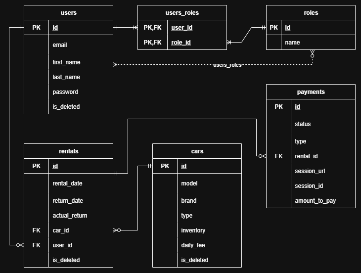

# CarSharingApp

## What is this project?

Welcome to CarSharingApp! This is an API (backend service) for managing a city car sharing service. It allows users to register, browse available cars, rent and return cars, and pay for rentals. Administrators can manage cars, users, rentals, and monitor payments. The goal is to replace an outdated manual, paper-based process with a modern online system.

## Tools I Used

| Tool | Version                      | Purpose |
| :--- |:-----------------------------| :--- |
| **Java** | 17                           | Programming language |
| **Spring Boot** | 3.5.4                        | Main application framework |
| **Spring Security** | 6.5.2      | Security & Authentication (JWT) |
| **Spring Data JPA** | 3.5.2       | Database access layer |
| **MySQL** | 9.3.0                        | Relational database |
| **Liquibase** | 4.31.1      | Database migrations |
| **JJWT** | 0.12.6                       | JWT token management |
| **Lombok** | 1.18.38                 | Boilerplate reduction |
| **MapStruct** | 1.5.5.Final                  | DTO <-> Entity mapping |
| **OpenAPI (SpringDoc)** | 2.8.14                       | API documentation and UI |
| **Checkstyle** | 3.3.0                        | Code style validation |
| **Docker** | 28.3.2                 | Containerization |
| **Testcontainers** | 1.18.0                       | Integration testing with Docker |
| **JUnit 5** | 5.12.2 | Unit testing framework |
| **Telegram Bots** | 6.9.7.1                      | Telegram integration |
| **Stripe Java** | 29.5.0                       | Stripe Checkout integration |
| **Apache Commons Lang** | 3.20.0                       | Utility helpers |


## Entity relations diagram



## What the API Can Do

Here is a list of what you can do with the API, based on your role.

#### For All Visitors (no login needed)

- `POST /auth/registration` - Register a new user
- `POST /auth/login` - Log in and receive a JWT access token

#### For Customers (Role: CUSTOMER)

- `GET /cars` - List available cars
- `GET /cars/{id}` - Get car details
- `GET /rentals/my?is_active=...` - List my rentals with optional active filter
- `GET /rentals/my/{id}` - Get my specific rental
- `POST /rentals` - Create a rental (decreases car inventory)
- `GET /payments/my` - List my payments
- `POST /payments` - Create a payment session for a rental (Stripe)
- `GET /payments/success?session_id=...` - Success redirect handler for Stripe
- `GET /payments/cancel?session_id=...` - Cancel redirect handler for Stripe

#### For Managers/Admins (Role: MANAGER)

- `POST /cars` - Add a new car
- `PUT /cars/{id}` - Update car info and inventory
- `DELETE /cars/{id}` - Delete a car
- `GET /users/me` - View my profile
- `PATCH /users/me` - Update my profile
- `PUT /users/{id}/role` - Update user role
- `GET /rentals?userId={id}&is_active=...` - View rentals for any user or all users
- `GET /rentals/{id}` - Get any rental by ID
- `POST /rentals/{id}/return` - Return a car (mark as completed)
- `GET /payments` - View all payments or filter by `userId`


## Domain Models

- **Car**
  - model: String
  - brand: String
  - type: Enum [SEDAN, SUV, HATCHBACK, UNIVERSAL]
  - inventory: int
  - dailyFee: decimal (USD)

- **User**
  - email: String
  - firstName: String
  - lastName: String
  - password: String
  - roles: Set<Role> [MANAGER, CUSTOMER]

- **Rental**
  - rentalDate: LocalDate
  - returnDate: LocalDate
  - actualReturnDate: LocalDate
  - car: Car (Many-to-One)
  - user: User (Many-to-One)

- **Payment**
  - status: Enum [PENDING, PAID]
  - type: Enum [PAYMENT, FINE]
  - rental: Rental (One-to-One)
  - sessionUrl: String
  - sessionId: String
  - amountToPay: decimal (USD)


## How to Run This Project

This project can be run in Docker. If you prefer, you can also run it locally with your own JDK and database. The steps below assume Docker.

**Prerequisites:**
- Git
- Docker
- Docker Compose

1. **Clone the repository**
   ```bash
   git clone https://github.com/Rom-Cola/CarSharingApp.git
   cd CarSharingApp
   ```

2. **Configure environment variables**
   - Copy `.env.template` to `.env` and fill in the values.
   - Description of variables used by Docker Compose and Spring:

     | Variable | Description | Example |
     | :-- | :-- | :-- |
     | `MYSQLDB_ROOT_PASSWORD` | Root password for MySQL service | `root_pass_123` |
     | `MYSQLDB_DATABASE` | Application database name | `car_sharing_db` |
     | `MYSQLDB_USER` | Application DB username | `app_user` |
     | `MYSQLDB_PASSWORD` | Application DB password | `app_user_pass` |
     | `MYSQL_LOCAL_PORT` | Host port mapped to MySQL container | `3306` |
     | `MYSQL_DOCKER_PORT` | MySQL port inside container (do not change) | `3306` |
     | `SPRING_LOCAL_PORT` | Host port for the app | `8088` |
     | `SPRING_DOCKER_PORT` | App port inside container (do not change) | `8080` |
     | `DEBUG_PORT` | Remote debug port exposed by the app container | `5005` |
     | `JWT_SECRET` | Secret for signing JWT tokens | long-random-string |
     | `TELEGRAM_BOT_TOKEN` | Token of your Telegram bot | `12345:abc...` |
     | `TELEGRAM_BOT_USERNAME` | Username/handle of the bot | `my_bot_name` |
     | `TELEGRAM_CHAT_ID` | Target chat ID for notifications | `-1001234567890` |
     | `STRIPE_SECRET_KEY` | Stripe secret API key | `sk_test_...` |

3. **Package the Application into a .jar File:**
   This is very important first step. Before Docker can build an image of your application, the application itself must be compiled and packaged into a `.jar` file. 
   
   To do this, run the correct command for your operating system from the root folder of the project. You do **not** need to have Maven installed, as the project uses the Maven Wrapper (`mvnw`).
   - Linux/macOS/Git Bash:
     ```bash
     ./mvnw clean package
     ```
   - Windows CMD/PowerShell:
     ```bash
     mvnw clean package
     ```

4. **Build and Run the Application (Docker Compose):**
   Use Docker Compose to build the images and start the containers. Ensure your `.env` is present and configured before running the command below.

   ```bash
   docker-compose up --build
   ```

    The first run may take a few minutes to pull base images and initialize MySQL.

5. **Open API docs (Swagger)**
   - Once the app is running, open Swagger UI in your browser at:
   - `http://localhost:<SPRING_LOCAL_PORT>/swagger-ui/index.html`
   - Default example (if `SPRING_LOCAL_PORT=8088`): `http://localhost:8088/swagger-ui/index.html`

6. **Stop the application**
   ```bash
   docker-compose down
   ```


## Security

- Stateless authentication using JWT access tokens
- Role-based access control (CUSTOMER vs MANAGER)
- Sensitive configuration via environment variables, not committed to VCS


## Payments (Stripe)

- Create payment sessions for rentals using Stripe Checkout
- Store `sessionUrl` and `sessionId` for follow-up checks
- Implement success and cancel redirect endpoints (`/payments/success`, `/payments/cancel`) with `session_id` query param
- For fines, compute the amount as: overdueDays × dailyFee × FINE_MULTIPLIER


## Notifications (Telegram)

- Send notifications to admins for:
  - New rentals created
  - Overdue rentals (scheduled daily check)
  - Successful payments


## Scheduled Tasks

- Daily job (cron `0 0 9 * * *`) to detect overdue rentals and send Telegram notifications


## Testing

- **Unit Tests**: JUnit + Mockito for service/business logic isolation
- **Integration Tests**: Testcontainers for controller and repository tests against real MySQL in Docker
- All tests are isolated

Run tests with Maven:
```bash
./mvnw test
```
(or `mvnw test` on Windows)

## Challenges and Solutions

In this project, I focused on four key challenges: implementing truly stateless security with JWT and clear roles (CUSTOMER, MANAGER);
integrating Stripe Checkout with reliable persistence of `sessionUrl`/`sessionId` and proper handling of success/cancel flows; setting up operational notifications via Telegram, including scheduled checks for overdue rentals;
and fully containerizing the development environment and database with Docker. Solving these made the API scalable, payment flows transparent, operationally observable, and local runs predictable and fast.
